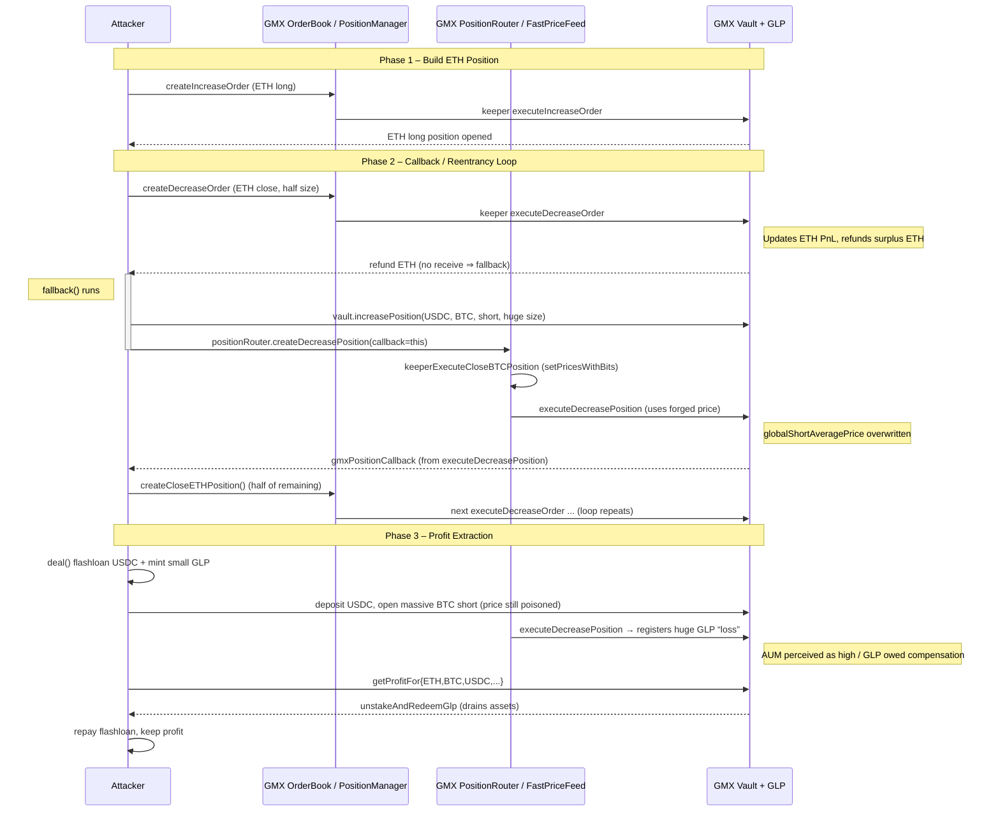

# GMX V1 攻击事件 分析覆現筆記
##### tags: `web3` `gmx`

## GMX V1 介紹


GMX V1 是 GMX 去中心化永續合約交易所（Perp DEX）的第一代版本，主要部署在 Arbitrum 與 Avalanche 網路，用戶可透過 GLP 流動性池進行槓桿交易與資產管理，允許使用者以最高 30 倍槓桿交易加密資產（如 ETH、BTC），並透過 GLP 池作為合約使用者的對手方。流動性提供者（LP）可透過存入資產（如 USDC、ETH）獲得 GLP 代幣。合約使用者可以開多頭或空頭部位，盈虧以 USD 計價。平台透過 Chainlink 預言機取得價格，並由 Keeper 自動化執行清算與限價單，以確保效率與安全性。。 不過在 2025 年 7 月，GMX V1 因設計漏洞遭駭客攻擊，造成約 4,000–4,200 萬美元損失

## 漏洞類型 - cross contract reentrancy 跨合约重入漏洞

refer to https://ackee.xyz/blog/cross-contract-reentrancy-attack/

**ReentrancyGuard 防禦不了cross contract reentrancy **

### ReentrancyGuard 介紹
OpenZeppelin ReentrancyGuard 的核心程式碼（簡化版）
```solidity
abstract contract ReentrancyGuard {
    uint256 private constant _NOT_ENTERED = 1;
    uint256 private constant _ENTERED = 2;

    uint256 private _status;

    constructor() {
        _status = _NOT_ENTERED;
    }

    modifier nonReentrant() {
        require(_status != _ENTERED, "ReentrancyGuard: reentrant call");
        _status = _ENTERED;

        _; // 執行原本的函式內容

        _status = _NOT_ENTERED;
    }
}
```
* 運作原理
    _status 是一個 合約內部的狀態變量，初始值為 _NOT_ENTERED。

    當函式被 nonReentrant 修飾時：

    進入函式前檢查 _status 是否為 _ENTERED。

    如果已經是 _ENTERED，代表函式正在執行中 → 阻止重入。

    如果不是，則設為 _ENTERED，執行函式內容。

    執行完畢後再把 _status 設回 _NOT_ENTERED。

* 關鍵點
    這個「鎖」只保護 同一合約內的函式，因為 _status 是合約自己的狀態變量。

    如果攻擊者透過 跨合約呼叫（例如 Vault → Attacker → Token），那麼 nonReentrant 的鎖不會阻止外部合約的邏輯，這就是為什麼它擋不住跨合約重入。
## GMX 專有名詞解釋
### AUM
一般情況 : $$ AUM = TVL + \text{全網多單未實現虧損} + \text{全網空單未實現虧損}$$
GMX V1: 
$$AUM = PoolAssets + (GlobalShorts_{PnL})$$ 
> 因 GMX 設計關係 $$GlobalLongs_{PnL}$$ 忽略不計
為什麼可以這樣簡化？
項目在 GMX V1 實際影響大小能否被攻擊者操控PoolAssets（真實資產）基礎值，變動慢很難多單未實現盈虧影響相對小（因為多單平均開倉價更新機制比較嚴）難操控空單未實現盈虧影響極大，而且 V1 有嚴重 bug極容易被刷爆
### GLP 價格 = AUM / GLP 總量
GMX 不靠預言機（Oracle）直接給 GLP 定價，而是根據「資產管理規模（AUM）」來算。
    
### 小結
如果全網做空的人虧錢了，這些虧損的錢理論上歸 GLP 持有者所有，所以 AUM 會變高。

AUM 變高 -> GLP價格被推高　
## Flow Diagram

## 攻擊思路 - 低買高賣
這就是經典的**「低買高賣」**，只是這個「高價」是攻擊者利用系統漏洞製造出來的。

1. 埋伏 (攻擊前)
動作： 攻擊者先用正常的價格（假設 GLP = $1）買入大量的 GLP。

成本： 假設他花了 100 萬美元，買了 100 萬顆 GLP。

此時池子裡有真金白銀。
2. 操縱 (攻擊中)
動作： 攻擊者發動我們剛才說的「重入攻擊」，讓系統誤以為空頭虧爛了。

現象： AUM 暴漲，導致 GLP 價格瞬間從 $1 飆升到 $10（假設值）。

注意：這時候池子裡的錢其實沒變多，只是系統的計算機「顯示」它變很有錢。

3. 收割 (然後呢？這裡最關鍵)
動作： 就在 GLP 價格顯示為 $10 的這短短一瞬間，攻擊者立刻調用合約函數 removeLiquidity（賣出/贖回 GLP）。

系統反應：

合約看了一眼報價：「喔，現在 GLP 一顆值 $10 呢。」

合約看了一眼攻擊者手裡：「你有 100 萬顆要賣。」

計算：「那我應該給你 $10 \times 100萬 = 1000萬美元。」

轉帳： 合約從保險箱（TVL）裡拿出 1000 萬美元的真幣（ETH/USDC） 發送給攻擊者。

4. 逃跑 (攻擊後)
結果：

攻擊者成本：100 萬。

攻擊者拿走：1000 萬。

淨賺：900 萬美元。

誰買單？ (倒楣鬼是誰)
這 900 萬美元是從哪裡來的？是從 GMX 的金庫 (Vault) 裡硬生生挖走的。

這意味著：其他的 GLP 持有者（真實的散戶 LP） 被割了韭菜。 因為金庫裡的錢被攻擊者提光了，等價格恢復正常後，大家會發現 GLP 的淨值暴跌（因為池子裡的真錢少了 900 萬）。

## 模擬victim 環境
### foundry 具體模擬事件
#### 主網分叉 (Mainnet Forking)
 `vm.createSelectFork("arbitrum", 355878385 - 1);`    
特定區塊: 參數 355878385 - 1 指定了區塊高度。這意味著測試環境的狀態（合約代碼、存儲數據、餘額等）完全回滾到了攻擊發生前的那個瞬間。

#### 帳戶模擬與偽裝 (Pranking)
```
vm.startPrank(orderBookKeeper_);
// ... 執行操作 ...
vm.stopPrank();

vm.startPrank(routerPositionKeeper_);
// ... 執行操作 ...
vm.stopPrank();
```
* 解釋:

    * 功能: startPrank(address) 讓接下來的外部調用（External Calls）看起來像是從指定的 address 發出的。

    * 目的: GMX 協議依賴特定的 "Keeper"（管理員/機器人）來執行開倉、平倉和更新價格。這些函數通常有 onlyKeeper 或類似的權限修飾符。在現實中，攻擊者無法控制這些 Keeper 的私鑰；但在 Foundry 模擬中，我們可以使用 Prank 繞過權限檢查，強制 Keeper 執行訂單或更新價格（例如 fastPriceFeed_.setPricesWithBitsAndExecute），從而在單個交易或測試中模擬異步的訂單執行過程。
#### 餘額操縱 (State Manipulation / Deal)
```
deal(address(usdc_), address(this), 3001000000);
deal(address(usdc_), address(this), 7_538_567_619570); 
vm.deal(address(this), 2 ether);
```
* 解釋:

    * deal(token, to, amount): 這是 forge-std 庫提供的輔助函數。它直接修改 ERC20 代幣合約在內存中的存儲槽（Storage Slot），憑空給 ContractTest 合約印出 USDC。這模擬了攻擊者通過閃電貸（Flashloan）獲取初始資金的步驟，省去了寫實際閃電貸邏輯的麻煩。

    * vm.deal(address, amount): 這是用於修改原生代幣（這裡是 ETH/WETH，視具體上下文而定，但 vm.deal 專指原生 ETH 餘額）的餘額。
#### 控制台日誌與調試 (Console Logging)

```
console2.log("eth balance of vault = ", ...);
console2.log("glp_manager_.getGlobalShortAveragePrice...", ...);
```

* 解釋:

    * 功能: 允許合約在測試執行期間向終端輸出數據。

    * 目的: 驗證攻擊前後的狀態: 代碼中分別打印了 "attack before" 和 "attack after" 的 GMX Vault 資產餘額，直觀地展示攻擊是否成功抽乾了流動性池。
    * 調試關鍵變量: 例如打印 globalShortAveragePrice，這是此攻擊邏輯（操縱空頭平均價格）的關鍵指標。
#### foundry 模擬小結
Fork 真實鏈上世界。
Deal 模擬flashloan。
Prank 系統管理員（Keeper）來操縱訂單執行和價格預言機。
最後利用 GMX 回調機制中的重入漏洞（在 gmxPositionCallback 和 fallback 中）完成獲利。
## 漏洞分析
攻擊者透過重入漏洞，繞過了 updateGlobalShortData() 的正常呼叫。


## Troubleshooting
* 模擬環境時，因為事件發生前的區塊時間過於老舊，無法用正常rpc抓取
    * 採用tenderly服務，設定區塊高度 `355878384`
    * 
    * `https://virtual.arbitrum.us-west.rpc.tenderly.co/38b8aa5b-1bc3-48c7-a155-a67ae384904e`
> 免費 Alchemy 沒 Archive Node
## demo

## ref
* https://github.com/SunWeb3Sec/DeFiHackLabs.git
* [20250709 - GMX V1 攻击事件: 重入漏洞导致的总体仓位价值操纵](https://www.cnblogs.com/ACaiGarden/p/18991716)
* https://www.quillaudits.com/blog/hack-analysis/how-gmx-lost-42m
* https://blog.solidityscan.com/gmx-v1-hack-analysis-ed0ab0c0dd0f
* https://www.certik.com/resources/blog/gmx-incident-analysis
* https://ackee.xyz/blog/gmx-hack-analysis-attack-scenarios-with-wake/
